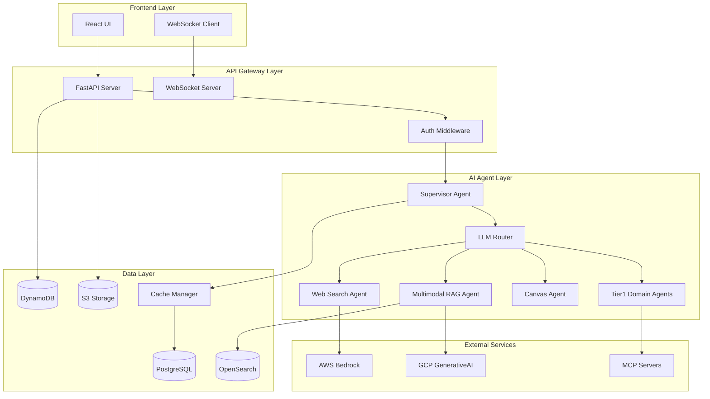
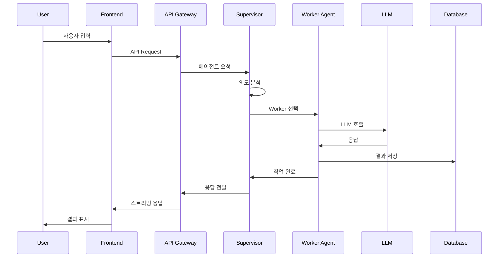

# AI 포탈 아키텍처 설계서
## 시스템 아키텍처 및 구현 가이드라인

---

## 📊 시스템 개요

### 아키텍처 설계 원칙
- **검증된 안정성**: SYGenai 운영 환경에서 검증된 패턴 활용
- **확장 가능성**: 모듈화된 설계로 새로운 기능 추가 용이
- **성능 최적화**: Redis 없이도 고성능을 보장하는 캐싱 전략
- **사용자 중심**: 직관적이고 반응성 있는 사용자 경험

### 기술 스택 개요
```
┌─ Frontend ─────────────────────────────────────────────────┐
│ React 18+ • TypeScript • TailwindCSS • Zustand • SWR      │
├─ API Gateway ──────────────────────────────────────────────┤
│ FastAPI • Pydantic • Uvicorn • WebSocket                  │
├─ AI Agents ────────────────────────────────────────────────┤
│ LangGraph • Claude (Bedrock) • Gemini (GenerativeAI)      │
├─ Data Layer ───────────────────────────────────────────────┤
│ PostgreSQL • DynamoDB • OpenSearch • S3                   │
└─ Infrastructure ──────────────────────────────────────────┘
│ Docker • Kubernetes • GitHub Actions • AWS/GCP           │
```

---

## 🏗️ 시스템 아키텍처

### 전체 시스템 구조


### 데이터 플로우


---

## 🤖 AI 에이전트 아키텍처

### LangGraph 기반 에이전트 구조
```python
from langgraph.graph import StateGraph
from typing import TypedDict, Annotated
import operator

class AgentState(TypedDict):
    messages: Annotated[list, operator.add]
    current_agent: str
    context: dict
    user_profile: dict
    workspace_id: str
    artifacts: list

class SupervisorAgent:
    """중앙 조정 에이전트 - 의도 분석 및 Worker 할당"""
    
    def __init__(self):
        self.llm_router = OptimizedLLMRouter()
        self.workers = {
            'web_search': WebSearchWorker(),
            'multimodal_rag': MultimodalRAGWorker(),
            'canvas': CanvasWorker(),
            'regulations': RegulationsWorker(),
            'legal': LegalWorker(),
            'accounting': AccountingWorker(),
            'tax': TaxWorker()
        }
        
        # LangGraph 상태 그래프 구성
        self.workflow = StateGraph(AgentState)
        self._build_workflow()
    
    def _build_workflow(self):
        """워크플로우 그래프 구성"""
        # 노드 추가
        self.workflow.add_node("supervisor", self.supervisor_node)
        self.workflow.add_node("web_search", self.workers['web_search'].execute)
        self.workflow.add_node("multimodal_rag", self.workers['multimodal_rag'].execute)
        self.workflow.add_node("canvas", self.workers['canvas'].execute)
        
        # Tier1 도메인 에이전트
        for agent_type in ['regulations', 'legal', 'accounting', 'tax']:
            self.workflow.add_node(agent_type, self.workers[agent_type].execute)
        
        # 엣지 및 조건부 라우팅
        self.workflow.set_entry_point("supervisor")
        self.workflow.add_conditional_edges(
            "supervisor",
            self.route_to_worker,
            {
                "web_search": "web_search",
                "multimodal_rag": "multimodal_rag", 
                "canvas": "canvas",
                "regulations": "regulations",
                "legal": "legal",
                "accounting": "accounting",
                "tax": "tax"
            }
        )
        
        # 종료 조건
        for worker in self.workers.keys():
            self.workflow.add_edge(worker, "__end__")
    
    async def supervisor_node(self, state: AgentState) -> AgentState:
        """Supervisor 의사결정 노드"""
        last_message = state["messages"][-1]
        user_profile = state.get("user_profile", {})
        
        # 의도 분석 프롬프트
        analysis_prompt = f"""
        사용자 메시지: {last_message['content']}
        사용자 프로필: {user_profile}
        
        다음 중 가장 적합한 에이전트를 선택하세요:
        - web_search: 실시간 웹 검색이 필요한 경우
        - multimodal_rag: 업로드된 파일 기반 질의응답
        - canvas: 워크스페이스에서 협업 작업
        - regulations: 규정 및 컴플라이언스 문의
        - legal: 법무 관련 문의
        - accounting: 회계 및 재무 분석
        - tax: 세무 처리 및 신고
        """
        
        # LLM으로 의도 분석
        model = await self.llm_router.get_optimal_model("intent_analysis", len(analysis_prompt))
        response = await model.ainvoke(analysis_prompt)
        
        selected_agent = self._parse_agent_selection(response.content)
        state["current_agent"] = selected_agent
        
        return state
    
    def route_to_worker(self, state: AgentState) -> str:
        """워커 라우팅 함수"""
        return state["current_agent"]
```

### LLM 라우팅 시스템
```python
from enum import Enum
from typing import Optional, Dict, Any
import asyncio
from anthropic import AsyncAnthropic
from google.generativeai import GenerativeModel
import google.generativeai as genai

class ModelType(Enum):
    CLAUDE_4_SONNET = "claude-4.0-sonnet"
    CLAUDE_37_SONNET = "claude-3.7-sonnet"
    CLAUDE_35_HAIKU = "claude-3.5-haiku"
    GEMINI_25_PRO = "gemini-2.5-pro"
    GEMINI_25_FLASH = "gemini-2.5-flash"
    GEMINI_20_FLASH = "gemini-2.0-flash"

class TaskType(Enum):
    COMPLEX_ANALYSIS = "complex_analysis"
    BALANCED_REASONING = "balanced_reasoning"
    QUICK_RESPONSE = "quick_response"
    MULTIMODAL = "multimodal"
    LARGE_CONTEXT = "large_context"

class OptimizedLLMRouter:
    """최적화된 LLM 라우팅 시스템"""
    
    def __init__(self):
        # 클라이언트 초기화
        self.anthropic = AsyncAnthropic(api_key=os.getenv("ANTHROPIC_API_KEY"))
        genai.configure(api_key=os.getenv("GOOGLE_API_KEY"))
        
        # 모델 성능 특성 정의
        self.model_specs = {
            ModelType.CLAUDE_4_SONNET: {
                "max_tokens": 200000,
                "cost_per_1k": 0.015,
                "speed_score": 7,
                "reasoning_score": 10,
                "multimodal": False
            },
            ModelType.CLAUDE_37_SONNET: {
                "max_tokens": 200000,
                "cost_per_1k": 0.010,
                "speed_score": 8,
                "reasoning_score": 9,
                "multimodal": False
            },
            ModelType.CLAUDE_35_HAIKU: {
                "max_tokens": 200000,
                "cost_per_1k": 0.005,
                "speed_score": 10,
                "reasoning_score": 7,
                "multimodal": False
            },
            ModelType.GEMINI_25_PRO: {
                "max_tokens": 2000000,
                "cost_per_1k": 0.007,
                "speed_score": 6,
                "reasoning_score": 9,
                "multimodal": True
            },
            ModelType.GEMINI_25_FLASH: {
                "max_tokens": 1000000,
                "cost_per_1k": 0.003,
                "speed_score": 9,
                "reasoning_score": 8,
                "multimodal": True
            },
            ModelType.GEMINI_20_FLASH: {
                "max_tokens": 1000000,
                "cost_per_1k": 0.002,
                "speed_score": 10,
                "reasoning_score": 7,
                "multimodal": True
            }
        }
        
        # 작업별 최적 모델 매핑
        self.task_model_mapping = {
            TaskType.COMPLEX_ANALYSIS: [
                ModelType.CLAUDE_4_SONNET,
                ModelType.GEMINI_25_PRO,
                ModelType.CLAUDE_37_SONNET
            ],
            TaskType.BALANCED_REASONING: [
                ModelType.CLAUDE_37_SONNET,
                ModelType.GEMINI_25_FLASH,
                ModelType.CLAUDE_35_HAIKU
            ],
            TaskType.QUICK_RESPONSE: [
                ModelType.CLAUDE_35_HAIKU,
                ModelType.GEMINI_20_FLASH,
                ModelType.GEMINI_25_FLASH
            ],
            TaskType.MULTIMODAL: [
                ModelType.GEMINI_25_PRO,
                ModelType.GEMINI_25_FLASH,
                ModelType.GEMINI_20_FLASH
            ],
            TaskType.LARGE_CONTEXT: [
                ModelType.GEMINI_25_PRO,
                ModelType.CLAUDE_4_SONNET,
                ModelType.CLAUDE_37_SONNET
            ]
        }
    
    async def get_optimal_model(self, task_type: str, context_length: int = 0, 
                              has_images: bool = False, priority: str = "balanced") -> Any:
        """최적 모델 선택 및 반환"""
        
        # 작업 유형 결정
        if has_images:
            task_enum = TaskType.MULTIMODAL
        elif context_length > 100000:
            task_enum = TaskType.LARGE_CONTEXT
        elif task_type in ["complex_analysis", "deep_reasoning"]:
            task_enum = TaskType.COMPLEX_ANALYSIS
        elif task_type in ["quick_response", "simple_qa"]:
            task_enum = TaskType.QUICK_RESPONSE
        else:
            task_enum = TaskType.BALANCED_REASONING
        
        # 후보 모델 목록
        candidate_models = self.task_model_mapping[task_enum]
        
        # 우선순위에 따른 모델 선택
        selected_model = self._select_by_priority(candidate_models, priority, context_length)
        
        # 모델 클라이언트 반환
        return await self._get_model_client(selected_model)
    
    def _select_by_priority(self, candidates: list, priority: str, context_length: int) -> ModelType:
        """우선순위 기반 모델 선택"""
        if priority == "cost":
            # 비용 최적화
            return min(candidates, key=lambda m: self.model_specs[m]["cost_per_1k"])
        elif priority == "speed":
            # 속도 최적화
            return max(candidates, key=lambda m: self.model_specs[m]["speed_score"])
        elif priority == "quality":
            # 품질 최적화
            return max(candidates, key=lambda m: self.model_specs[m]["reasoning_score"])
        else:
            # 균형잡힌 선택 (기본값)
            return self._balanced_selection(candidates, context_length)
    
    def _balanced_selection(self, candidates: list, context_length: int) -> ModelType:
        """균형잡힌 모델 선택 알고리즘"""
        scores = {}
        
        for model in candidates:
            spec = self.model_specs[model]
            
            # 컨텍스트 길이 적합성
            context_score = 1.0 if context_length <= spec["max_tokens"] else 0.5
            
            # 종합 점수 계산 (속도, 품질, 비용의 가중평균)
            total_score = (
                spec["speed_score"] * 0.3 +
                spec["reasoning_score"] * 0.4 +
                (10 - spec["cost_per_1k"] * 100) * 0.2 +  # 비용 역수
                context_score * 0.1
            )
            
            scores[model] = total_score
        
        return max(scores, key=scores.get)
    
    async def _get_model_client(self, model_type: ModelType) -> Any:
        """모델별 클라이언트 반환"""
        if model_type.value.startswith("claude"):
            return await self._get_claude_client(model_type)
        elif model_type.value.startswith("gemini"):
            return await self._get_gemini_client(model_type)
        else:
            raise ValueError(f"Unsupported model type: {model_type}")
    
    async def _get_claude_client(self, model_type: ModelType):
        """Claude 모델 클라이언트"""
        # AWS Bedrock을 통한 Claude 접근
        # 실제 구현에서는 boto3의 bedrock-runtime 클라이언트 사용
        class ClaudeWrapper:
            def __init__(self, client, model_id):
                self.client = client
                self.model_id = model_id
            
            async def ainvoke(self, prompt: str, **kwargs):
                # Bedrock API 호출 구현
                pass
        
        return ClaudeWrapper(self.anthropic, model_type.value)
    
    async def _get_gemini_client(self, model_type: ModelType):
        """Gemini 모델 클라이언트"""
        model_id_mapping = {
            ModelType.GEMINI_25_PRO: "gemini-2.5-pro",
            ModelType.GEMINI_25_FLASH: "gemini-2.5-flash",
            ModelType.GEMINI_20_FLASH: "gemini-2.0-flash"
        }
        
        return GenerativeModel(model_id_mapping[model_type])
```

---

## 💾 데이터 아키텍처

### PostgreSQL 스키마 설계
```sql
-- 확장 및 기본 설정
CREATE EXTENSION IF NOT EXISTS "uuid-ossp";
CREATE EXTENSION IF NOT EXISTS "pg_trgm";  -- 텍스트 검색 성능 향상

-- 사용자 및 인증 (SYGenai 호환 확장)
CREATE TABLE users (
    empno VARCHAR(20) PRIMARY KEY,
    name_ko VARCHAR(100) NOT NULL,
    company VARCHAR(100),
    company_code VARCHAR(10),
    roles JSONB DEFAULT '[]'::jsonb,
    permissions JSONB DEFAULT '{}'::jsonb,
    profile_data JSONB DEFAULT '{}'::jsonb,  -- 자동 수집된 프로파일
    preferences JSONB DEFAULT '{}'::jsonb,   -- 사용자 설정
    created_at TIMESTAMP WITH TIME ZONE DEFAULT NOW(),
    updated_at TIMESTAMP WITH TIME ZONE DEFAULT NOW()
);

-- 사용자 인덱스
CREATE INDEX idx_users_company ON users(company_code);
CREATE INDEX idx_users_profile ON users USING GIN(profile_data);
CREATE INDEX idx_users_updated ON users(updated_at);

-- 캐시 테이블 (Redis 대체)
CREATE TABLE cache_entries (
    key VARCHAR(255) PRIMARY KEY,
    data JSONB NOT NULL,
    expires_at TIMESTAMP WITH TIME ZONE NOT NULL,
    tags TEXT[] DEFAULT '{}',  -- 캐시 태깅
    created_at TIMESTAMP WITH TIME ZONE DEFAULT NOW(),
    accessed_at TIMESTAMP WITH TIME ZONE DEFAULT NOW(),
    access_count INTEGER DEFAULT 0
);

-- 캐시 인덱스 (성능 최적화)
CREATE INDEX idx_cache_expires ON cache_entries(expires_at);
CREATE INDEX idx_cache_tags ON cache_entries USING GIN(tags);
CREATE INDEX idx_cache_accessed ON cache_entries(accessed_at);

-- 자동 만료된 캐시 정리 함수
CREATE OR REPLACE FUNCTION cleanup_expired_cache()
RETURNS INTEGER AS $$
DECLARE
    deleted_count INTEGER;
BEGIN
    DELETE FROM cache_entries WHERE expires_at <= NOW();
    GET DIAGNOSTICS deleted_count = ROW_COUNT;
    RETURN deleted_count;
END;
$$ LANGUAGE plpgsql;

-- 워크스페이스 및 협업
CREATE TABLE workspaces (
    id UUID PRIMARY KEY DEFAULT uuid_generate_v4(),
    owner_empno VARCHAR(20) NOT NULL REFERENCES users(empno) ON DELETE CASCADE,
    title VARCHAR(200) NOT NULL,
    description TEXT,
    settings JSONB DEFAULT '{}'::jsonb,
    collaborators JSONB DEFAULT '[]'::jsonb,
    visibility VARCHAR(20) DEFAULT 'private' CHECK (visibility IN ('private', 'team', 'public')),
    status VARCHAR(20) DEFAULT 'active' CHECK (status IN ('active', 'archived', 'deleted')),
    created_at TIMESTAMP WITH TIME ZONE DEFAULT NOW(),
    updated_at TIMESTAMP WITH TIME ZONE DEFAULT NOW()
);

-- 워크스페이스 인덱스
CREATE INDEX idx_workspaces_owner ON workspaces(owner_empno);
CREATE INDEX idx_workspaces_status ON workspaces(status);
CREATE INDEX idx_workspaces_updated ON workspaces(updated_at);
CREATE INDEX idx_workspaces_collaborators ON workspaces USING GIN(collaborators);

-- 아티팩트 (워크스페이스 결과물)
CREATE TABLE artifacts (
    id UUID PRIMARY KEY DEFAULT uuid_generate_v4(),
    workspace_id UUID NOT NULL REFERENCES workspaces(id) ON DELETE CASCADE,
    parent_id UUID REFERENCES artifacts(id),  -- 버전 관리용
    type VARCHAR(50) NOT NULL,  -- 'document', 'code', 'chart', 'image', 'data'
    title VARCHAR(200),
    description TEXT,
    content JSONB NOT NULL,
    metadata JSONB DEFAULT '{}'::jsonb,
    version INTEGER DEFAULT 1,
    status VARCHAR(20) DEFAULT 'draft' CHECK (status IN ('draft', 'published', 'archived')),
    created_by VARCHAR(20) NOT NULL REFERENCES users(empno),
    created_at TIMESTAMP WITH TIME ZONE DEFAULT NOW(),
    updated_at TIMESTAMP WITH TIME ZONE DEFAULT NOW()
);

-- 아티팩트 인덱스
CREATE INDEX idx_artifacts_workspace ON artifacts(workspace_id);
CREATE INDEX idx_artifacts_type ON artifacts(type);
CREATE INDEX idx_artifacts_created_by ON artifacts(created_by);
CREATE INDEX idx_artifacts_parent ON artifacts(parent_id);
CREATE INDEX idx_artifacts_updated ON artifacts(updated_at);

-- 대화 및 메시지 (기본 구조)
CREATE TABLE conversations (
    id UUID PRIMARY KEY DEFAULT uuid_generate_v4(),
    user_empno VARCHAR(20) NOT NULL REFERENCES users(empno),
    workspace_id UUID REFERENCES workspaces(id),
    title VARCHAR(200),
    context JSONB DEFAULT '{}'::jsonb,
    agent_config JSONB DEFAULT '{}'::jsonb,
    created_at TIMESTAMP WITH TIME ZONE DEFAULT NOW(),
    updated_at TIMESTAMP WITH TIME ZONE DEFAULT NOW()
);

CREATE INDEX idx_conversations_user ON conversations(user_empno);
CREATE INDEX idx_conversations_workspace ON conversations(workspace_id);
CREATE INDEX idx_conversations_updated ON conversations(updated_at);

CREATE TABLE messages (
    id UUID PRIMARY KEY DEFAULT uuid_generate_v4(),
    conversation_id UUID NOT NULL REFERENCES conversations(id) ON DELETE CASCADE,
    role VARCHAR(20) NOT NULL CHECK (role IN ('user', 'assistant', 'system')),
    content TEXT NOT NULL,
    metadata JSONB DEFAULT '{}'::jsonb,
    agent_type VARCHAR(50),
    model_used VARCHAR(50),
    tokens_used INTEGER,
    processing_time FLOAT,
    created_at TIMESTAMP WITH TIME ZONE DEFAULT NOW()
);

CREATE INDEX idx_messages_conversation ON messages(conversation_id);
CREATE INDEX idx_messages_created ON messages(created_at);
CREATE INDEX idx_messages_agent ON messages(agent_type);

-- Tier1 에이전트 MCP 설정
CREATE TABLE agent_mcp_configs (
    id UUID PRIMARY KEY DEFAULT uuid_generate_v4(),
    agent_type VARCHAR(50) NOT NULL UNIQUE,  -- 'regulations', 'legal', 'accounting', 'tax'
    name VARCHAR(100) NOT NULL,
    description TEXT,
    config_data JSONB NOT NULL,
    is_active BOOLEAN DEFAULT true,
    created_by VARCHAR(20) NOT NULL REFERENCES users(empno),
    created_at TIMESTAMP WITH TIME ZONE DEFAULT NOW(),
    updated_at TIMESTAMP WITH TIME ZONE DEFAULT NOW()
);

CREATE INDEX idx_agent_configs_type ON agent_mcp_configs(agent_type);
CREATE INDEX idx_agent_configs_active ON agent_mcp_configs(is_active);

-- 사용자별 에이전트 권한
CREATE TABLE user_agent_permissions (
    empno VARCHAR(20) REFERENCES users(empno) ON DELETE CASCADE,
    agent_type VARCHAR(50),
    permissions JSONB DEFAULT '{}'::jsonb,
    granted_by VARCHAR(20) REFERENCES users(empno),
    granted_at TIMESTAMP WITH TIME ZONE DEFAULT NOW(),
    expires_at TIMESTAMP WITH TIME ZONE,
    PRIMARY KEY (empno, agent_type)
);

CREATE INDEX idx_user_agent_perms_granted ON user_agent_permissions(granted_at);
CREATE INDEX idx_user_agent_perms_expires ON user_agent_permissions(expires_at);

-- 새미 GPT 기능 설정
CREATE TABLE user_feature_preferences (
    empno VARCHAR(20) PRIMARY KEY REFERENCES users(empno) ON DELETE CASCADE,
    enable_deep_research BOOLEAN DEFAULT true,
    enable_web_search BOOLEAN DEFAULT true,
    enable_canvas_mode BOOLEAN DEFAULT true,
    enable_file_processing BOOLEAN DEFAULT true,
    model_preference JSONB DEFAULT '{}'::jsonb,  -- 사용자별 모델 선호도
    ui_preferences JSONB DEFAULT '{}'::jsonb,    -- UI 설정
    updated_at TIMESTAMP WITH TIME ZONE DEFAULT NOW()
);

-- 사용자 프로파일 자동 수집 로그
CREATE TABLE profile_collection_logs (
    id UUID PRIMARY KEY DEFAULT uuid_generate_v4(),
    empno VARCHAR(20) NOT NULL REFERENCES users(empno) ON DELETE CASCADE,
    data_source VARCHAR(100) NOT NULL,  -- 'chat_interaction', 'file_upload', 'workspace_activity'
    collected_data JSONB NOT NULL,
    confidence_score FLOAT CHECK (confidence_score >= 0 AND confidence_score <= 1),
    processed BOOLEAN DEFAULT false,
    created_at TIMESTAMP WITH TIME ZONE DEFAULT NOW()
);

CREATE INDEX idx_profile_logs_user ON profile_collection_logs(empno, created_at);
CREATE INDEX idx_profile_logs_source ON profile_collection_logs(data_source);
CREATE INDEX idx_profile_logs_processed ON profile_collection_logs(processed);

-- 활동 로그 (협업 추적)
CREATE TABLE activity_logs (
    id UUID PRIMARY KEY DEFAULT uuid_generate_v4(),
    empno VARCHAR(20) NOT NULL REFERENCES users(empno),
    action VARCHAR(100) NOT NULL,
    resource_type VARCHAR(50),
    resource_id UUID,
    metadata JSONB DEFAULT '{}'::jsonb,
    ip_address INET,
    user_agent TEXT,
    timestamp TIMESTAMP WITH TIME ZONE DEFAULT NOW()
);

-- 활동 로그 파티셔닝 (성능 최적화)
CREATE INDEX idx_activity_logs_user_time ON activity_logs(empno, timestamp);
CREATE INDEX idx_activity_logs_action ON activity_logs(action);
CREATE INDEX idx_activity_logs_resource ON activity_logs(resource_type, resource_id);

-- 파일 및 업로드 관리
CREATE TABLE uploaded_files (
    id UUID PRIMARY KEY DEFAULT uuid_generate_v4(),
    user_empno VARCHAR(20) NOT NULL REFERENCES users(empno),
    workspace_id UUID REFERENCES workspaces(id),
    original_name VARCHAR(500) NOT NULL,
    stored_name VARCHAR(500) NOT NULL,
    file_type VARCHAR(100),
    file_size BIGINT,
    mime_type VARCHAR(200),
    storage_path TEXT NOT NULL,
    checksum VARCHAR(64),  -- SHA-256 해시
    processing_status VARCHAR(20) DEFAULT 'pending' 
        CHECK (processing_status IN ('pending', 'processing', 'completed', 'failed')),
    extracted_text TEXT,
    metadata JSONB DEFAULT '{}'::jsonb,
    created_at TIMESTAMP WITH TIME ZONE DEFAULT NOW(),
    processed_at TIMESTAMP WITH TIME ZONE
);

CREATE INDEX idx_files_user ON uploaded_files(user_empno);
CREATE INDEX idx_files_workspace ON uploaded_files(workspace_id);
CREATE INDEX idx_files_status ON uploaded_files(processing_status);
CREATE INDEX idx_files_type ON uploaded_files(file_type);
CREATE INDEX idx_files_checksum ON uploaded_files(checksum);

-- 트리거 함수들 (자동 업데이트)
CREATE OR REPLACE FUNCTION update_updated_at_column()
RETURNS TRIGGER AS $$
BEGIN
    NEW.updated_at = NOW();
    RETURN NEW;
END;
$$ LANGUAGE plpgsql;

-- updated_at 자동 업데이트 트리거
CREATE TRIGGER update_users_updated_at
    BEFORE UPDATE ON users
    FOR EACH ROW EXECUTE FUNCTION update_updated_at_column();

CREATE TRIGGER update_workspaces_updated_at
    BEFORE UPDATE ON workspaces
    FOR EACH ROW EXECUTE FUNCTION update_updated_at_column();

CREATE TRIGGER update_artifacts_updated_at
    BEFORE UPDATE ON artifacts
    FOR EACH ROW EXECUTE FUNCTION update_updated_at_column();

CREATE TRIGGER update_conversations_updated_at
    BEFORE UPDATE ON conversations
    FOR EACH ROW EXECUTE FUNCTION update_updated_at_column();

-- 성능 최적화를 위한 뷰
CREATE VIEW active_workspaces AS
SELECT w.*, u.name_ko as owner_name
FROM workspaces w
JOIN users u ON w.owner_empno = u.empno
WHERE w.status = 'active';

CREATE VIEW recent_activity AS
SELECT 
    al.*, 
    u.name_ko as user_name,
    CASE 
        WHEN al.resource_type = 'workspace' THEN w.title
        WHEN al.resource_type = 'artifact' THEN a.title
        ELSE NULL
    END as resource_name
FROM activity_logs al
JOIN users u ON al.empno = u.empno
LEFT JOIN workspaces w ON al.resource_type = 'workspace' AND al.resource_id = w.id
LEFT JOIN artifacts a ON al.resource_type = 'artifact' AND al.resource_id = a.id
WHERE al.timestamp >= NOW() - INTERVAL '7 days'
ORDER BY al.timestamp DESC;
```

### Redis 대체 캐싱 시스템
```python
import asyncio
import json
import time
from datetime import datetime, timedelta
from typing import Any, Optional, Dict, List, Set
from collections import defaultdict
from cachetools import TTLCache
import asyncpg
from contextlib import asynccontextmanager

class OptimizedCacheManager:
    """Redis 없이 PostgreSQL + 메모리를 활용한 고성능 캐싱"""
    
    def __init__(self, db_pool: asyncpg.Pool):
        self.db_pool = db_pool
        
        # L1 캐시: 애플리케이션 메모리 (가장 빠름)
        self.memory_cache = TTLCache(maxsize=10000, ttl=300)  # 5분 TTL
        
        # Hot 데이터 식별을 위한 액세스 추적
        self.access_tracker = defaultdict(int)
        self.last_cleanup = time.time()
        
        # 캐시 통계
        self.stats = {
            'l1_hits': 0,
            'l2_hits': 0,
            'misses': 0,
            'writes': 0
        }
    
    async def get(self, key: str) -> Optional[Any]:
        """캐시에서 데이터 조회 (L1 -> L2 순서)"""
        
        # L1: 메모리 캐시 확인 (가장 빠름)
        if key in self.memory_cache:
            self.stats['l1_hits'] += 1
            self.access_tracker[key] += 1
            return self.memory_cache[key]
        
        # L2: PostgreSQL 캐시 테이블 확인
        try:
            async with self.db_pool.acquire() as conn:
                row = await conn.fetchrow(
                    """
                    UPDATE cache_entries 
                    SET accessed_at = NOW(), access_count = access_count + 1
                    WHERE key = $1 AND expires_at > NOW()
                    RETURNING data, access_count
                    """,
                    key
                )
                
                if row:
                    data = row['data']
                    self.stats['l2_hits'] += 1
                    
                    # L1 캐시에 승격 (자주 액세스되는 데이터)
                    if row['access_count'] > 3:
                        self.memory_cache[key] = data
                    
                    return data
        
        except Exception as e:
            # 데이터베이스 오류 시에도 서비스 계속 제공
            print(f"Cache L2 error: {e}")
        
        self.stats['misses'] += 1
        return None
    
    async def set(self, key: str, value: Any, ttl: int = 300, tags: List[str] = None) -> bool:
        """캐시에 데이터 저장"""
        try:
            # L1: 메모리 캐시에 저장 (TTL 적용)
            self.memory_cache[key] = value
            
            # L2: PostgreSQL 영속 저장
            expires_at = datetime.utcnow() + timedelta(seconds=ttl)
            tags = tags or []
            
            async with self.db_pool.acquire() as conn:
                await conn.execute(
                    """
                    INSERT INTO cache_entries (key, data, expires_at, tags)
                    VALUES ($1, $2, $3, $4)
                    ON CONFLICT (key) DO UPDATE SET
                        data = EXCLUDED.data,
                        expires_at = EXCLUDED.expires_at,
                        tags = EXCLUDED.tags,
                        accessed_at = NOW()
                    """,
                    key, json.dumps(value), expires_at, tags
                )
            
            self.stats['writes'] += 1
            return True
            
        except Exception as e:
            print(f"Cache write error: {e}")
            return False
    
    async def invalidate(self, key: str) -> bool:
        """특정 키 캐시 무효화"""
        # L1 캐시에서 제거
        self.memory_cache.pop(key, None)
        
        # L2 캐시에서 제거
        try:
            async with self.db_pool.acquire() as conn:
                result = await conn.execute(
                    "DELETE FROM cache_entries WHERE key = $1", key
                )
                return result == "DELETE 1"
        except Exception as e:
            print(f"Cache invalidation error: {e}")
            return False
    
    async def invalidate_by_tags(self, tags: List[str]) -> int:
        """태그 기반 캐시 무효화"""
        if not tags:
            return 0
            
        try:
            async with self.db_pool.acquire() as conn:
                # 해당 태그를 가진 키들 조회
                rows = await conn.fetch(
                    "SELECT key FROM cache_entries WHERE tags && $1", tags
                )
                
                # L1 캐시에서 해당 키들 제거
                for row in rows:
                    self.memory_cache.pop(row['key'], None)
                
                # L2 캐시에서 삭제
                result = await conn.execute(
                    "DELETE FROM cache_entries WHERE tags && $1", tags
                )
                
                return int(result.split()[-1])  # "DELETE N"에서 N 추출
                
        except Exception as e:
            print(f"Cache tag invalidation error: {e}")
            return 0
    
    async def cleanup_expired(self) -> int:
        """만료된 캐시 정리"""
        current_time = time.time()
        
        # 1분에 한 번만 정리 실행
        if current_time - self.last_cleanup < 60:
            return 0
        
        try:
            async with self.db_pool.acquire() as conn:
                deleted_count = await conn.fetchval(
                    "SELECT cleanup_expired_cache()"
                )
                
                self.last_cleanup = current_time
                return deleted_count or 0
                
        except Exception as e:
            print(f"Cache cleanup error: {e}")
            return 0
    
    def get_stats(self) -> Dict[str, Any]:
        """캐시 통계 반환"""
        total_requests = sum([
            self.stats['l1_hits'],
            self.stats['l2_hits'], 
            self.stats['misses']
        ])
        
        if total_requests == 0:
            return self.stats
        
        return {
            **self.stats,
            'hit_rate': (self.stats['l1_hits'] + self.stats['l2_hits']) / total_requests,
            'l1_hit_rate': self.stats['l1_hits'] / total_requests,
            'memory_cache_size': len(self.memory_cache),
            'memory_cache_maxsize': self.memory_cache.maxsize
        }
    
    async def warm_up(self, keys: List[str]) -> int:
        """캐시 웜업 - 자주 사용되는 키들을 미리 L1 캐시로 로드"""
        warmed_count = 0
        
        try:
            async with self.db_pool.acquire() as conn:
                rows = await conn.fetch(
                    """
                    SELECT key, data FROM cache_entries 
                    WHERE key = ANY($1) AND expires_at > NOW()
                    ORDER BY access_count DESC
                    """,
                    keys
                )
                
                for row in rows:
                    self.memory_cache[row['key']] = row['data']
                    warmed_count += 1
                    
        except Exception as e:
            print(f"Cache warmup error: {e}")
        
        return warmed_count

# WebSocket 상태 관리
class WebSocketStateManager:
    """실시간 협업을 위한 WebSocket 상태 관리"""
    
    def __init__(self, cache_manager: OptimizedCacheManager):
        self.cache = cache_manager
        self.active_connections: Dict[str, Set] = defaultdict(set)
        self.user_workspaces: Dict[str, Set[str]] = defaultdict(set)
    
    async def join_workspace(self, workspace_id: str, websocket, user_id: str):
        """워크스페이스 참여"""
        self.active_connections[workspace_id].add(websocket)
        self.user_workspaces[user_id].add(workspace_id)
        
        # 사용자 상태를 캐시에 저장
        await self.cache.set(
            f"ws_user:{workspace_id}:{user_id}",
            {
                "status": "active",
                "joined_at": time.time(),
                "workspace_id": workspace_id
            },
            ttl=3600,  # 1시간
            tags=[f"workspace:{workspace_id}", f"user:{user_id}"]
        )
        
        # 다른 사용자들에게 참여 알림
        await self.broadcast_to_workspace(workspace_id, {
            "type": "user_joined",
            "user_id": user_id,
            "timestamp": time.time()
        }, exclude_user=user_id)
    
    async def leave_workspace(self, workspace_id: str, websocket, user_id: str):
        """워크스페이스 떠나기"""
        self.active_connections[workspace_id].discard(websocket)
        self.user_workspaces[user_id].discard(workspace_id)
        
        # 사용자 상태 제거
        await self.cache.invalidate(f"ws_user:{workspace_id}:{user_id}")
        
        # 다른 사용자들에게 떠남 알림
        await self.broadcast_to_workspace(workspace_id, {
            "type": "user_left", 
            "user_id": user_id,
            "timestamp": time.time()
        })
    
    async def broadcast_to_workspace(self, workspace_id: str, message: Dict, 
                                   exclude_user: str = None):
        """워크스페이스 내 모든 사용자에게 메시지 브로드캐스트"""
        connections = self.active_connections.get(workspace_id, set()).copy()
        
        failed_connections = set()
        
        for websocket in connections:
            try:
                # exclude_user 체크 (websocket에 user_id가 있다면)
                if hasattr(websocket, 'user_id') and websocket.user_id == exclude_user:
                    continue
                    
                await websocket.send_json(message)
                
            except Exception as e:
                print(f"WebSocket send error: {e}")
                failed_connections.add(websocket)
        
        # 실패한 연결들 정리
        for failed_ws in failed_connections:
            self.active_connections[workspace_id].discard(failed_ws)
    
    async def get_active_users(self, workspace_id: str) -> List[Dict]:
        """워크스페이스 활성 사용자 목록"""
        try:
            # 캐시에서 활성 사용자 조회
            pattern_key = f"ws_user:{workspace_id}:*"
            # 실제 구현에서는 Redis SCAN과 유사한 기능 필요
            # 여기서는 단순화된 버전
            
            active_users = []
            for user_id in self.user_workspaces:
                if workspace_id in self.user_workspaces[user_id]:
                    user_data = await self.cache.get(f"ws_user:{workspace_id}:{user_id}")
                    if user_data:
                        active_users.append({
                            "user_id": user_id,
                            **user_data
                        })
            
            return active_users
            
        except Exception as e:
            print(f"Get active users error: {e}")
            return []
```

---

## 🔐 보안 아키텍처

### 인증 및 권한 관리
```python
from fastapi import Depends, HTTPException, status
from fastapi.security import HTTPBearer, HTTPAuthorizationCredentials
from typing import List, Optional
import jwt
from datetime import datetime, timedelta

class SecurityManager:
    """통합 보안 관리"""
    
    def __init__(self, secret_key: str, db_pool):
        self.secret_key = secret_key
        self.db_pool = db_pool
        self.security = HTTPBearer()
    
    async def create_access_token(self, user_data: dict, expires_delta: Optional[timedelta] = None):
        """JWT 토큰 생성"""
        to_encode = user_data.copy()
        if expires_delta:
            expire = datetime.utcnow() + expires_delta
        else:
            expire = datetime.utcnow() + timedelta(hours=24)
        
        to_encode.update({"exp": expire})
        encoded_jwt = jwt.encode(to_encode, self.secret_key, algorithm="HS256")
        return encoded_jwt
    
    async def verify_token(self, credentials: HTTPAuthorizationCredentials = Depends(HTTPBearer())):
        """JWT 토큰 검증"""
        try:
            payload = jwt.decode(credentials.credentials, self.secret_key, algorithms=["HS256"])
            empno = payload.get("empno")
            if empno is None:
                raise HTTPException(
                    status_code=status.HTTP_401_UNAUTHORIZED,
                    detail="Invalid authentication credentials"
                )
            return payload
        except jwt.PyJWTError:
            raise HTTPException(
                status_code=status.HTTP_401_UNAUTHORIZED,
                detail="Invalid authentication credentials"
            )
    
    async def get_current_user(self, token_data: dict = Depends(verify_token)):
        """현재 사용자 정보 조회"""
        async with self.db_pool.acquire() as conn:
            user = await conn.fetchrow(
                "SELECT * FROM users WHERE empno = $1", token_data["empno"]
            )
            if not user:
                raise HTTPException(
                    status_code=status.HTTP_404_NOT_FOUND,
                    detail="User not found"
                )
            return dict(user)
    
    async def check_permissions(self, user: dict, resource: str, action: str) -> bool:
        """권한 확인"""
        user_permissions = user.get('permissions', {})
        
        # 관리자는 모든 권한
        if 'admin' in user.get('roles', []):
            return True
        
        # 리소스별 권한 확인
        resource_permissions = user_permissions.get(resource, {})
        return resource_permissions.get(action, False)
    
    async def check_agent_access(self, user_empno: str, agent_type: str) -> bool:
        """에이전트 접근 권한 확인"""
        async with self.db_pool.acquire() as conn:
            result = await conn.fetchrow(
                """
                SELECT permissions FROM user_agent_permissions 
                WHERE empno = $1 AND agent_type = $2 
                AND (expires_at IS NULL OR expires_at > NOW())
                """,
                user_empno, agent_type
            )
            
            return result is not None

# 입력 검증
from pydantic import BaseModel, validator
from typing import List, Optional
import re

class ChatRequest(BaseModel):
    message: str
    agent_type: Optional[str] = "general"
    model_preference: Optional[str] = None
    workspace_id: Optional[str] = None
    files: Optional[List[str]] = None
    
    @validator('message')
    def validate_message(cls, v):
        if len(v.strip()) == 0:
            raise ValueError('Message cannot be empty')
        if len(v) > 10000:  # 메시지 길이 제한
            raise ValueError('Message too long')
        
        # 악성 패턴 검사
        malicious_patterns = [
            r'<script.*?>.*?</script>',  # XSS 방지
            r'javascript:',
            r'on\w+\s*=',  # 이벤트 핸들러
        ]
        
        for pattern in malicious_patterns:
            if re.search(pattern, v, re.IGNORECASE):
                raise ValueError('Malicious content detected')
        
        return v.strip()
    
    @validator('agent_type')
    def validate_agent_type(cls, v):
        allowed_agents = [
            'general', 'web_search', 'multimodal_rag', 
            'canvas', 'regulations', 'legal', 'accounting', 'tax'
        ]
        if v not in allowed_agents:
            raise ValueError(f'Invalid agent type. Must be one of: {allowed_agents}')
        return v

# Rate Limiting
from fastapi import Request
from collections import defaultdict
import time

class RateLimiter:
    """API Rate Limiting"""
    
    def __init__(self):
        self.requests = defaultdict(list)
        self.limits = {
            'default': {'requests': 100, 'window': 3600},  # 1시간에 100회
            'chat': {'requests': 50, 'window': 3600},      # 1시간에 50회 채팅
            'upload': {'requests': 20, 'window': 3600},    # 1시간에 20회 업로드
        }
    
    async def check_rate_limit(self, request: Request, endpoint: str = 'default') -> bool:
        """Rate limit 확인"""
        client_ip = request.client.host
        current_time = time.time()
        
        limit_config = self.limits.get(endpoint, self.limits['default'])
        window_size = limit_config['window']
        max_requests = limit_config['requests']
        
        # 현재 시간 기준으로 윈도우 내 요청들만 유지
        user_requests = self.requests[f"{client_ip}:{endpoint}"]
        self.requests[f"{client_ip}:{endpoint}"] = [
            req_time for req_time in user_requests 
            if current_time - req_time < window_size
        ]
        
        # 현재 요청 추가
        self.requests[f"{client_ip}:{endpoint}"].append(current_time)
        
        # Rate limit 확인
        return len(self.requests[f"{client_ip}:{endpoint}"]) <= max_requests

# 미들웨어 설정
from fastapi import FastAPI
from fastapi.middleware.cors import CORSMiddleware
from fastapi.middleware.trustedhost import TrustedHostMiddleware

def setup_security_middleware(app: FastAPI):
    """보안 미들웨어 설정"""
    
    # CORS 설정
    app.add_middleware(
        CORSMiddleware,
        allow_origins=["http://localhost:3000"],  # 프로덕션에서는 실제 도메인
        allow_credentials=True,
        allow_methods=["GET", "POST", "PUT", "DELETE"],
        allow_headers=["*"],
    )
    
    # 신뢰할 수 있는 호스트만 허용
    app.add_middleware(
        TrustedHostMiddleware, 
        allowed_hosts=["localhost", "127.0.0.1", "*.yourdomain.com"]
    )
```

---

## 📈 성능 최적화

### 데이터베이스 최적화
```python
import asyncpg
from typing import Optional
import json

class DatabaseOptimizer:
    """데이터베이스 성능 최적화"""
    
    def __init__(self, db_pool: asyncpg.Pool):
        self.db_pool = db_pool
    
    async def optimize_queries(self):
        """쿼리 최적화 설정"""
        async with self.db_pool.acquire() as conn:
            # PostgreSQL 성능 설정
            await conn.execute("SET work_mem = '256MB'")
            await conn.execute("SET shared_buffers = '256MB'") 
            await conn.execute("SET effective_cache_size = '1GB'")
            await conn.execute("SET random_page_cost = 1.1")  # SSD 최적화
            
            # JSON 쿼리 최적화
            await conn.execute("SET enable_seqscan = off")  # 인덱스 사용 강제
    
    async def create_optimal_indexes(self):
        """성능 최적화 인덱스 생성"""
        indexes = [
            # 복합 인덱스
            "CREATE INDEX CONCURRENTLY IF NOT EXISTS idx_messages_conv_created ON messages(conversation_id, created_at DESC)",
            "CREATE INDEX CONCURRENTLY IF NOT EXISTS idx_artifacts_workspace_updated ON artifacts(workspace_id, updated_at DESC)",
            
            # 부분 인덱스 (조건부)
            "CREATE INDEX CONCURRENTLY IF NOT EXISTS idx_active_workspaces ON workspaces(owner_empno) WHERE status = 'active'",
            "CREATE INDEX CONCURRENTLY IF NOT EXISTS idx_recent_activity ON activity_logs(empno, timestamp) WHERE timestamp >= NOW() - INTERVAL '30 days'",
            
            # JSON 인덱스 (JSONB 필드용)
            "CREATE INDEX CONCURRENTLY IF NOT EXISTS idx_user_profile_skills ON users USING GIN((profile_data->'skills'))",
            "CREATE INDEX CONCURRENTLY IF NOT EXISTS idx_artifact_metadata ON artifacts USING GIN(metadata)",
            
            # 전문 검색 인덱스
            "CREATE INDEX CONCURRENTLY IF NOT EXISTS idx_workspace_title_search ON workspaces USING GIN(to_tsvector('english', title))",
            "CREATE INDEX CONCURRENTLY IF NOT EXISTS idx_artifact_content_search ON artifacts USING GIN(to_tsvector('english', coalesce(title, '') || ' ' || coalesce(description, '')))",
        ]
        
        async with self.db_pool.acquire() as conn:
            for index_sql in indexes:
                try:
                    await conn.execute(index_sql)
                except Exception as e:
                    print(f"Index creation failed: {e}")
    
    async def analyze_query_performance(self, query: str, params: tuple = None) -> dict:
        """쿼리 성능 분석"""
        async with self.db_pool.acquire() as conn:
            # EXPLAIN ANALYZE 실행
            explain_query = f"EXPLAIN (ANALYZE, BUFFERS, FORMAT JSON) {query}"
            
            if params:
                result = await conn.fetchval(explain_query, *params)
            else:
                result = await conn.fetchval(explain_query)
            
            return result[0]  # JSON 결과 반환

# 연결 풀 최적화
async def create_optimized_pool():
    """최적화된 데이터베이스 연결 풀"""
    return await asyncpg.create_pool(
        host="localhost",
        port=5432,
        user="postgres", 
        password="password",
        database="ai_portal",
        min_size=10,           # 최소 연결 수
        max_size=50,           # 최대 연결 수
        max_queries=5000,      # 연결당 최대 쿼리 수
        max_inactive_connection_lifetime=300.0,  # 비활성 연결 수명 (5분)
        command_timeout=60,    # 명령 타임아웃
        server_settings={
            'application_name': 'ai_portal',
            'jit': 'off',      # JIT 컴파일 비활성화 (작은 쿼리에 오버헤드)
        }
    )

# API 응답 최적화
from fastapi import BackgroundTasks
import asyncio

class ResponseOptimizer:
    """API 응답 최적화"""
    
    @staticmethod
    async def batch_database_operations(operations: list):
        """데이터베이스 작업 배치 처리"""
        # 여러 작업을 하나의 트랜잭션으로 묶어 처리
        async with db_pool.acquire() as conn:
            async with conn.transaction():
                results = []
                for operation in operations:
                    result = await operation(conn)
                    results.append(result)
                return results
    
    @staticmethod
    async def parallel_data_fetch(fetchers: list):
        """병렬 데이터 조회"""
        # 독립적인 데이터 조회 작업들을 병렬로 실행
        tasks = [asyncio.create_task(fetcher()) for fetcher in fetchers]
        return await asyncio.gather(*tasks)
    
    @staticmethod
    def background_task_handler(background_tasks: BackgroundTasks, task_func, *args, **kwargs):
        """백그라운드 작업 처리"""
        background_tasks.add_task(task_func, *args, **kwargs)

# 프론트엔드 성능 최적화
class FrontendOptimizer:
    """프론트엔드 성능 최적화 가이드"""
    
    @staticmethod
    def get_optimization_config():
        return {
            # React 최적화
            "react": {
                "lazy_loading": "React.lazy() 사용으로 컴포넌트 지연 로딩",
                "memoization": "React.memo, useMemo, useCallback 적절히 활용",
                "virtualization": "react-window로 긴 리스트 가상화",
                "code_splitting": "Dynamic import로 번들 분할"
            },
            
            # 상태 관리 최적화
            "state_management": {
                "zustand_slices": "Zustand 스토어를 기능별로 분할",
                "selective_subscription": "필요한 상태만 구독",
                "computed_values": "파생 상태는 selector로 계산",
                "persistence": "중요한 상태만 localStorage에 저장"
            },
            
            # 네트워크 최적화
            "network": {
                "swr_caching": "SWR로 데이터 캐싱 및 재검증",
                "request_deduplication": "동일 요청 중복 제거",
                "optimistic_updates": "낙관적 업데이트로 UX 개선",
                "websocket_management": "WebSocket 연결 효율적 관리"
            },
            
            # 빌드 최적화
            "build": {
                "tree_shaking": "사용하지 않는 코드 제거",
                "asset_optimization": "이미지, 폰트 최적화",
                "service_worker": "캐싱 전략으로 로딩 성능 향상",
                "cdn": "정적 자산 CDN 배포"
            }
        }
```

---

## 🔄 배포 및 운영

### Docker 최적화
```dockerfile
# 프론트엔드 최적화 Dockerfile
FROM node:18-alpine AS frontend-build

# 작업 디렉토리 설정
WORKDIR /app

# 패키지 파일 복사 (캐시 최적화)
COPY package*.json ./
RUN npm ci --only=production

# 소스 코드 복사
COPY . .

# 프로덕션 빌드
RUN npm run build

# 프로덕션 이미지
FROM nginx:alpine AS production
COPY --from=frontend-build /app/dist /usr/share/nginx/html
COPY nginx.conf /etc/nginx/nginx.conf

EXPOSE 80
CMD ["nginx", "-g", "daemon off;"]

---

# 백엔드 최적화 Dockerfile
FROM python:3.11-slim AS backend-build

# 시스템 의존성 설치
RUN apt-get update && apt-get install -y \
    build-essential \
    curl \
    && rm -rf /var/lib/apt/lists/*

WORKDIR /app

# Python 의존성 설치 (캐시 최적화)
COPY requirements.txt .
RUN pip install --no-cache-dir -r requirements.txt

# 애플리케이션 코드 복사
COPY . .

# 프로덕션 서버 실행
EXPOSE 8000
CMD ["uvicorn", "app.main:app", "--host", "0.0.0.0", "--port", "8000", "--workers", "4"]
```

### Kubernetes 배포 설정
```yaml
# ai-portal-deployment.yaml
apiVersion: apps/v1
kind: Deployment
metadata:
  name: ai-portal-backend
  labels:
    app: ai-portal-backend
spec:
  replicas: 3
  selector:
    matchLabels:
      app: ai-portal-backend
  template:
    metadata:
      labels:
        app: ai-portal-backend
    spec:
      containers:
      - name: backend
        image: ai-portal/backend:latest
        ports:
        - containerPort: 8000
        env:
        - name: DATABASE_URL
          valueFrom:
            secretKeyRef:
              name: ai-portal-secrets
              key: database-url
        - name: ANTHROPIC_API_KEY
          valueFrom:
            secretKeyRef:
              name: ai-portal-secrets
              key: anthropic-key
        resources:
          requests:
            memory: "2Gi"
            cpu: "1000m"
          limits:
            memory: "4Gi"
            cpu: "2000m"
        livenessProbe:
          httpGet:
            path: /health
            port: 8000
          initialDelaySeconds: 30
          periodSeconds: 10
        readinessProbe:
          httpGet:
            path: /ready
            port: 8000
          initialDelaySeconds: 5
          periodSeconds: 5

---
apiVersion: v1
kind: Service
metadata:
  name: ai-portal-backend-service
spec:
  selector:
    app: ai-portal-backend
  ports:
  - protocol: TCP
    port: 80
    targetPort: 8000
  type: ClusterIP

---
apiVersion: apps/v1
kind: Deployment
metadata:
  name: ai-portal-frontend
spec:
  replicas: 2
  selector:
    matchLabels:
      app: ai-portal-frontend
  template:
    metadata:
      labels:
        app: ai-portal-frontend
    spec:
      containers:
      - name: frontend
        image: ai-portal/frontend:latest
        ports:
        - containerPort: 80
        resources:
          requests:
            memory: "512Mi"
            cpu: "250m"
          limits:
            memory: "1Gi"
            cpu: "500m"

---
apiVersion: networking.k8s.io/v1
kind: Ingress
metadata:
  name: ai-portal-ingress
  annotations:
    nginx.ingress.kubernetes.io/rewrite-target: /
    nginx.ingress.kubernetes.io/ssl-redirect: "true"
spec:
  tls:
  - hosts:
    - ai-portal.yourdomain.com
    secretName: ai-portal-tls
  rules:
  - host: ai-portal.yourdomain.com
    http:
      paths:
      - path: /api
        pathType: Prefix
        backend:
          service:
            name: ai-portal-backend-service
            port:
              number: 80
      - path: /
        pathType: Prefix
        backend:
          service:
            name: ai-portal-frontend-service
            port:
              number: 80
```

### CI/CD 파이프라인
```yaml
# .github/workflows/deploy.yml
name: AI Portal CI/CD

on:
  push:
    branches: [ main, develop ]
  pull_request:
    branches: [ main ]

env:
  REGISTRY: ghcr.io
  IMAGE_NAME: ${{ github.repository }}

jobs:
  test:
    runs-on: ubuntu-latest
    steps:
    - uses: actions/checkout@v3
    
    - name: Set up Python
      uses: actions/setup-python@v4
      with:
        python-version: '3.11'
    
    - name: Install backend dependencies
      run: |
        cd backend
        pip install -r requirements.txt
        pip install pytest pytest-asyncio
    
    - name: Run backend tests
      run: |
        cd backend
        pytest tests/ -v --cov=app --cov-report=xml
    
    - name: Set up Node.js
      uses: actions/setup-node@v3
      with:
        node-version: '18'
    
    - name: Install frontend dependencies
      run: |
        cd frontend
        npm ci
    
    - name: Run frontend tests
      run: |
        cd frontend
        npm run test:ci
    
    - name: Build frontend
      run: |
        cd frontend
        npm run build

  security-scan:
    runs-on: ubuntu-latest
    steps:
    - uses: actions/checkout@v3
    
    - name: Run security scan
      uses: securecodewarrior/github-action-add-sarif@v1
      with:
        sarif-file: security-scan-results.sarif

  build-and-push:
    needs: [test, security-scan]
    runs-on: ubuntu-latest
    if: github.ref == 'refs/heads/main'
    steps:
    - uses: actions/checkout@v3
    
    - name: Log in to Container Registry
      uses: docker/login-action@v2
      with:
        registry: ${{ env.REGISTRY }}
        username: ${{ github.actor }}
        password: ${{ secrets.GITHUB_TOKEN }}
    
    - name: Build and push backend image
      uses: docker/build-push-action@v4
      with:
        context: ./backend
        push: true
        tags: ${{ env.REGISTRY }}/${{ env.IMAGE_NAME }}/backend:latest
    
    - name: Build and push frontend image
      uses: docker/build-push-action@v4
      with:
        context: ./frontend
        push: true
        tags: ${{ env.REGISTRY }}/${{ env.IMAGE_NAME }}/frontend:latest

  deploy:
    needs: build-and-push
    runs-on: ubuntu-latest
    if: github.ref == 'refs/heads/main'
    steps:
    - uses: actions/checkout@v3
    
    - name: Deploy to Kubernetes
      uses: azure/k8s-deploy@v1
      with:
        manifests: |
          k8s/ai-portal-deployment.yaml
          k8s/ai-portal-service.yaml
          k8s/ai-portal-ingress.yaml
```

---

## 📊 모니터링 및 관찰가능성

### Langsmith 통합
```python
from langsmith import traceable, Client
from typing import Dict, Any
import os

class LangsmithTracker:
    """Langsmith 통합 추적"""
    
    def __init__(self):
        self.client = Client(
            api_url="https://api.smith.langchain.com",
            api_key=os.getenv("LANGSMITH_API_KEY")
        )
    
    @traceable(name="agent_execution")
    async def track_agent_execution(self, agent_type: str, input_data: Dict, 
                                  user_id: str, workspace_id: str = None) -> Dict:
        """에이전트 실행 추적"""
        
        metadata = {
            "agent_type": agent_type,
            "user_id": user_id,
            "workspace_id": workspace_id,
            "timestamp": time.time()
        }
        
        # 에이전트 실행 로직
        result = await self._execute_agent(agent_type, input_data)
        
        # 추가 메타데이터
        metadata.update({
            "execution_time": result.get("execution_time"),
            "model_used": result.get("model_used"),
            "tokens_used": result.get("tokens_used"),
            "success": result.get("success", False)
        })
        
        return {
            **result,
            "trace_metadata": metadata
        }
    
    @traceable(name="llm_call")
    async def track_llm_call(self, model: str, prompt: str, response: str, 
                           tokens_used: int, execution_time: float):
        """LLM 호출 추적"""
        return {
            "model": model,
            "prompt_length": len(prompt),
            "response_length": len(response), 
            "tokens_used": tokens_used,
            "execution_time": execution_time,
            "cost_estimate": self._calculate_cost(model, tokens_used)
        }
    
    def _calculate_cost(self, model: str, tokens: int) -> float:
        """비용 계산"""
        cost_per_token = {
            "claude-4.0-sonnet": 0.000015,
            "claude-3.7-sonnet": 0.000010,
            "claude-3.5-haiku": 0.000005,
            "gemini-2.5-pro": 0.000007,
            "gemini-2.5-flash": 0.000003,
            "gemini-2.0-flash": 0.000002
        }
        return tokens * cost_per_token.get(model, 0.00001)
```

### 성능 메트릭
```python
from prometheus_client import Counter, Histogram, Gauge, generate_latest
from fastapi import Request, Response
import time

# Prometheus 메트릭 정의
REQUEST_COUNT = Counter(
    'http_requests_total',
    'Total HTTP requests',
    ['method', 'endpoint', 'status']
)

REQUEST_DURATION = Histogram(
    'http_request_duration_seconds',
    'HTTP request duration',
    ['method', 'endpoint']
)

ACTIVE_CONNECTIONS = Gauge(
    'websocket_active_connections',
    'Active WebSocket connections',
    ['workspace_id']
)

AGENT_EXECUTIONS = Counter(
    'agent_executions_total',
    'Total agent executions',
    ['agent_type', 'status']
)

LLM_TOKEN_USAGE = Counter(
    'llm_tokens_used_total',
    'Total LLM tokens used',
    ['model', 'agent_type']
)

CACHE_OPERATIONS = Counter(
    'cache_operations_total',
    'Cache operations',
    ['operation', 'level', 'status']
)

class MetricsMiddleware:
    """성능 메트릭 미들웨어"""
    
    def __init__(self, app):
        self.app = app
    
    async def __call__(self, scope, receive, send):
        if scope["type"] == "http":
            request = Request(scope, receive)
            start_time = time.time()
            
            # 응답 처리
            async def send_wrapper(message):
                if message["type"] == "http.response.start":
                    status_code = message["status"]
                    duration = time.time() - start_time
                    
                    # 메트릭 업데이트
                    REQUEST_COUNT.labels(
                        method=request.method,
                        endpoint=request.url.path,
                        status=status_code
                    ).inc()
                    
                    REQUEST_DURATION.labels(
                        method=request.method,
                        endpoint=request.url.path
                    ).observe(duration)
                
                await send(message)
            
            await self.app(scope, receive, send_wrapper)
        else:
            await self.app(scope, receive, send)

# 대시보드 설정
GRAFANA_DASHBOARD_CONFIG = {
    "dashboard": {
        "title": "AI Portal Monitoring",
        "panels": [
            {
                "title": "Request Rate",
                "type": "graph",
                "targets": [
                    {
                        "expr": "rate(http_requests_total[5m])",
                        "legendFormat": "{{method}} {{endpoint}}"
                    }
                ]
            },
            {
                "title": "Response Time",
                "type": "graph", 
                "targets": [
                    {
                        "expr": "histogram_quantile(0.95, rate(http_request_duration_seconds_bucket[5m]))",
                        "legendFormat": "95th percentile"
                    }
                ]
            },
            {
                "title": "Agent Performance",
                "type": "table",
                "targets": [
                    {
                        "expr": "rate(agent_executions_total[1h])",
                        "legendFormat": "{{agent_type}}"
                    }
                ]
            },
            {
                "title": "LLM Token Usage",
                "type": "pie",
                "targets": [
                    {
                        "expr": "sum by (model) (llm_tokens_used_total)",
                        "legendFormat": "{{model}}"
                    }
                ]
            }
        ]
    }
}
```

---

## 🚀 **최신 아키텍처 개선 (2025-08-19)**

### ✅ 인라인 UI 아키텍처 혁신
```typescript
// 새로운 통합 ChatInput 아키텍처
interface ChatInputArchitecture {
  // 팝업 기반 → 인라인 통합 설계
  popup_elimination: {
    before: "별도 PopupAISettings 컴포넌트",
    after: "ChatInput 내부 통합 드롭다운",
    benefits: ["UX 단순화", "상태 관리 최적화", "접근성 향상"]
  },
  
  // 모델 선택 아키텍처  
  model_selection: {
    component: "InlineModelDropdown",
    positioning: "bottom-full mb-2 (상향 열림)",
    providers: ["Claude (Star 아이콘)", "Gemini (Zap 아이콘)"],
    models: "8개 통합 (4 + 4)",
    responsive: "isMobile 기반 적응형 크기"
  },
  
  // 기능 토글 시스템
  feature_toggles: {
    layout: "inline horizontal",
    position: "파일 첨부 아이콘 옆",
    buttons: ["웹 검색 🔍", "심층 리서치 📊", "Canvas 🎨"],
    interaction: "단일 선택 + 재클릭 해제",
    styling: "반응형 텍스트 라벨"
  }
}
```

### ✅ 메타 검색 시스템 아키텍처
```python
# 2단계 메타 검색 체인 설계
class MetaSearchArchitecture:
    def __init__(self):
        self.conversation_context_service = ConversationContextService()
        self.information_gap_analyzer = InformationGapAnalyzer() 
        self.agent_suggestion_modal = AgentSuggestionModal()
    
    async def meta_search_pipeline(self, user_query: str, context: Dict):
        # 1단계: 사용자 의도 + 대화 맥락 분석
        intent_analysis = await self.analyze_user_intent(user_query, context)
        
        # 2단계: 최적화된 검색 쿼리 생성
        optimized_queries = await self.generate_search_queries(intent_analysis)
        
        # 3단계: 정보 부족 영역 식별
        info_gaps = await self.information_gap_analyzer.analyze(user_query)
        
        # 4단계: 최적 에이전트 추천
        recommended_agent = await self.suggest_optimal_agent(intent_analysis)
        
        return SearchPlan(
            queries=optimized_queries,
            info_gaps=info_gaps,
            recommended_agent=recommended_agent
        )
```

### ✅ Gemini 2.x 모델 아키텍처 업그레이드
```typescript
// 업그레이드된 모델 타입 시스템
type GeminiModelArchitecture = {
  "gemini-2.5-pro": {
    capabilities: ["reasoning", "multimodal", "analysis", "creative"],
    speed: "medium",
    use_cases: ["대용량 컨텍스트", "멀티모달 작업"],
    isRecommended: true
  },
  "gemini-2.5-flash": {
    capabilities: ["reasoning", "quick_tasks", "multimodal"], 
    speed: "fast",
    use_cases: ["빠른 추론", "실시간 처리"]
  },
  "gemini-2.0-pro": {
    capabilities: ["reasoning", "analysis", "multimodal"],
    speed: "medium", 
    use_cases: ["안정적인 고성능 작업"]
  },
  "gemini-2.0-flash": {
    capabilities: ["reasoning", "quick_tasks", "multimodal"],
    speed: "fast",
    use_cases: ["빠르고 효율적인 처리"]
  }
}
```

### 🔧 컴포넌트 아키텍처 혁신
- **단일 책임 원칙**: ChatInput이 모든 AI 설정 담당
- **상태 동기화**: Provider-Model 자동 연동 로직
- **반응형 설계**: 모바일/데스크톱 통합 대응
- **타입 안전성**: 완전한 TypeScript 타입 시스템

---

**문서 버전**: v1.1  
**최종 업데이트**: 2025-08-19  
**작성자**: AI 포탈 아키텍처 팀  
**검토자**: CTO

---

> 📚 **참고사항**: 이 아키텍처 문서는 develop.md의 설계 명세를 구체적인 구현 가이드로 변환한 것입니다. 최신 인라인 UI 시스템과 메타 검색 아키텍처가 추가되었습니다. 실제 구현 시 프로젝트 요구사항과 환경에 맞게 조정하여 사용하시기 바랍니다.