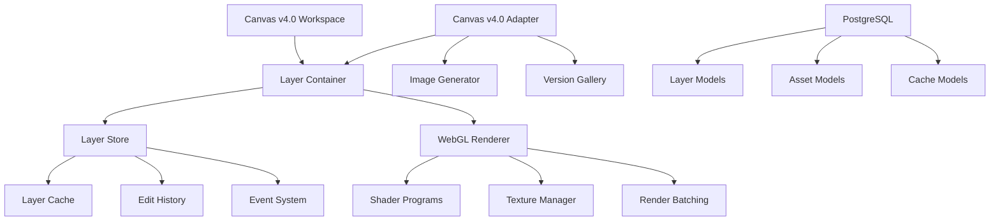

# Canvas v4.0 다중 이미지 편집 & 레이어 시스템 아키텍처 설계서

## 📋 개요

Canvas v4.0 시스템에 완전한 다중 이미지 편집 및 레이어 시스템을 도입하는 종합 아키텍처입니다. 기존 Canvas v4.0의 안정성을 유지하면서 Adobe Photoshop/Figma 수준의 고급 편집 기능을 제공합니다.

### 🎯 핵심 목표

- **완전한 호환성**: 기존 Canvas v4.0 시스템과 100% 호환
- **전문가급 기능**: Adobe Photoshop 수준의 레이어 편집 시스템
- **실시간 성능**: WebGL 기반 60fps 실시간 렌더링
- **확장 가능성**: 플러그인 아키텍처로 무한 확장
- **엔터프라이즈 안정성**: 대용량 데이터 및 동시 편집 지원

## 🏗️ 전체 시스템 아키텍처

### 시스템 계층 구조

```
┌─────────────────────────────────────────────────────────────┐
│                    사용자 인터페이스 계층                        │
├─────────────────────────────────────────────────────────────┤
│  Canvas v4.0 UI    │  Layer Panel  │  Tools Panel  │ Props │
├─────────────────────────────────────────────────────────────┤
│                    비즈니스 로직 계층                           │
├─────────────────────────────────────────────────────────────┤
│  Layer Store  │  Canvas Store  │  Image Session Store      │
├─────────────────────────────────────────────────────────────┤
│                    렌더링 엔진 계층                             │
├─────────────────────────────────────────────────────────────┤
│  WebGL Renderer  │  Canvas 2D Fallback  │  Cache Manager  │
├─────────────────────────────────────────────────────────────┤
│                    데이터 액세스 계층                           │
├─────────────────────────────────────────────────────────────┤
│  PostgreSQL  │  File Storage  │  Cache Layer  │  Real-time │
└─────────────────────────────────────────────────────────────┘
```

### 핵심 컴포넌트 관계도



## 📁 파일 구조

```
frontend/src/
├── types/
│   ├── layer.ts                    # 레이어 시스템 타입 정의
│   └── canvas.ts                   # 기존 Canvas v4.0 타입 (확장)
├── stores/
│   ├── layerStore.ts              # 레이어 상태 관리 (Zustand)
│   ├── canvasStore.ts             # 기존 Canvas v4.0 스토어
│   └── imageSessionStore.ts       # 기존 이미지 세션 스토어
├── engines/
│   ├── WebGLRenderer.ts           # WebGL 렌더링 엔진
│   ├── Canvas2DRenderer.ts        # Canvas 2D 폴백 렌더러
│   └── LayerCompositor.ts         # 레이어 합성 엔진
├── adapters/
│   └── CanvasV4LayerAdapter.ts    # Canvas v4.0 호환성 어댑터
├── components/
│   ├── layer/
│   │   ├── LayerPanel.tsx         # 레이어 패널 UI
│   │   ├── LayerItem.tsx          # 개별 레이어 아이템
│   │   ├── LayerToolbar.tsx       # 레이어 도구 모음
│   │   └── LayerProperties.tsx    # 레이어 속성 패널
│   ├── tools/
│   │   ├── SelectionTool.tsx      # 선택 도구
│   │   ├── TransformTool.tsx      # 변형 도구
│   │   ├── BrushTool.tsx          # 브러시 도구
│   │   └── MaskingTool.tsx        # 마스킹 도구
│   └── canvas/
│       ├── CanvasWorkspace.tsx    # 기존 Canvas 워크스페이스 (확장)
│       ├── LayerCanvas.tsx        # 레이어 전용 캔버스
│       └── ImageGenerator.tsx     # 기존 이미지 생성기 (통합)
└── services/
    ├── LayerService.ts            # 레이어 비즈니스 로직
    ├── RenderService.ts           # 렌더링 서비스
    └── CacheService.ts            # 캐시 관리 서비스

backend/app/
├── db/models/
│   ├── layer.py                   # 레이어 데이터 모델
│   └── canvas.py                  # 기존 Canvas 모델 (확장)
├── api/v1/
│   ├── layers.py                  # 레이어 API 엔드포인트
│   └── canvas.py                  # 기존 Canvas API (확장)
├── services/
│   ├── layer_service.py           # 레이어 서비스
│   ├── render_service.py          # 렌더링 서비스
│   └── cache_service.py           # 캐시 서비스
└── agents/workers/
    └── layer_processor.py         # 레이어 처리 에이전트
```

## 🔧 1. 레이어 시스템 설계

### 1.1 레이어 타입 계층

```typescript
enum LayerType {
  BACKGROUND = 'background',    // 배경 레이어
  IMAGE = 'image',             // 이미지 레이어
  TEXT = 'text',               // 텍스트 레이어
  SHAPE = 'shape',             // 도형 레이어
  EFFECT = 'effect',           // 효과 레이어
  MASK = 'mask',               // 마스크 레이어
  GROUP = 'group'              // 그룹 레이어
}
```

### 1.2 레이어 상태 관리

**핵심 인터페이스:**
- `LayerContainer`: 레이어들의 컨테이너 (Canvas v4.0와 1:1 매핑)
- `Layer`: 개별 레이어 (ImageLayer, TextLayer, GroupLayer 등)
- `LayerTransform`: 변형 정보 (위치, 크기, 회전, 기울기)
- `LayerState`: 가시성, 잠금, 불투명도, 블렌드 모드

**특징:**
- **계층 구조**: 부모-자식 관계로 그룹 관리
- **Z-Index 관리**: 렌더링 순서 제어
- **다중 선택**: 여러 레이어 동시 편집
- **실시간 동기화**: 변경사항 즉시 반영

### 1.3 변형 시스템

```typescript
interface LayerTransform {
  x: number;          // X 좌표
  y: number;          // Y 좌표
  scaleX: number;     // X축 크기
  scaleY: number;     // Y축 크기
  rotation: number;   // 회전 (도)
  skewX: number;      // X축 기울기
  skewY: number;      // Y축 기울기
  offsetX: number;    // X 오프셋
  offsetY: number;    // Y 오프셋
}
```

**고급 기능:**
- **비파괴 변형**: 원본 데이터 보존
- **변형 행렬**: GPU 가속 변형 계산
- **제약 조건**: 비율 고정, 그리드 스냅
- **키프레임**: 애니메이션 지원 (미래)

### 1.4 블렌드 모드

```typescript
enum BlendMode {
  NORMAL = 'normal',
  MULTIPLY = 'multiply',
  SCREEN = 'screen',
  OVERLAY = 'overlay',
  SOFT_LIGHT = 'soft_light',
  HARD_LIGHT = 'hard_light',
  COLOR_DODGE = 'color_dodge',
  COLOR_BURN = 'color_burn',
  DARKEN = 'darken',
  LIGHTEN = 'lighten',
  DIFFERENCE = 'difference',
  EXCLUSION = 'exclusion'
}
```

## 🎨 2. 다중 이미지 처리 시스템

### 2.1 이미지 레이어 구조

```typescript
interface ImageLayer extends BaseLayer {
  content: {
    imageUrl: string;           // 메인 이미지 URL
    originalUrl?: string;       // 원본 URL
    thumbnailUrl?: string;      // 썸네일 URL
    naturalWidth: number;       // 원본 가로 크기
    naturalHeight: number;      // 원본 세로 크기
    format: 'jpeg' | 'png' | 'webp' | 'svg';
    
    // AI 생성 이미지 메타데이터
    aiGenerated?: {
      prompt: string;
      model: string;
      style: string;
      seed?: number;
      generatedAt: string;
    };
  };
}
```

### 2.2 다중 이미지 관리

**특징:**
- **독립적 레이어**: 각 이미지가 독립 레이어
- **자동 배치**: 스마트 위치 조정 알고리즘
- **일괄 작업**: 다중 이미지 동시 편집
- **버전 관리**: 이미지별 편집 히스토리

**배치 알고리즘:**
```typescript
// 자동 배치 예시
const autoArrangeImages = (images: ImageLayer[]): void => {
  const cols = Math.ceil(Math.sqrt(images.length));
  const spacing = 20;
  const maxWidth = 200;
  
  images.forEach((layer, index) => {
    const row = Math.floor(index / cols);
    const col = index % cols;
    
    layer.transform.x = col * (maxWidth + spacing);
    layer.transform.y = row * (maxWidth + spacing);
  });
};
```

### 2.3 이미지 최적화

**성능 최적화:**
- **레이지 로딩**: 뷰포트 내 이미지만 로드
- **다해상도 지원**: 확대/축소에 따른 적응형 해상도
- **포맷 최적화**: WebP 우선, 폴백 지원
- **압축 관리**: 품질/용량 균형

## 🛠️ 3. 편집 도구 시스템

### 3.1 선택 도구

```typescript
enum SelectionTool {
  RECTANGLE = 'rectangle',     // 사각형 선택
  LASSO = 'lasso',            // 올가미 선택
  MAGIC_WAND = 'magic_wand',  // 마법봉 선택
  COLOR_RANGE = 'color_range' // 색상 범위 선택
}
```

**고급 선택 기능:**
- **페더링**: 경계 부드럽게 처리
- **안티앨리어싱**: 계단 현상 제거
- **복합 선택**: 추가/빼기/교집합 연산
- **선택 저장**: 선택 영역 재사용

### 3.2 변형 도구

**변형 모드:**
- **자유 변형**: 모든 변형 적용
- **균등 비율**: 비율 유지 크기 조정
- **원근 변형**: 3D 원근 효과
- **왜곡**: 자유곡선 변형

**스마트 가이드:**
```typescript
interface SmartGuide {
  type: 'center' | 'edge' | 'grid';
  position: { x: number; y: number };
  magnetic: boolean;  // 자석 효과
  visible: boolean;
}
```

### 3.3 마스킹 시스템

```typescript
interface LayerMask {
  type: 'alpha' | 'clipping' | 'vector';
  data: string | Path2D;     // 마스크 데이터
  inverted: boolean;         // 마스크 반전
  feather: number;           // 경계 흐리기
}
```

**마스킹 기능:**
- **알파 마스크**: 투명도 기반 마스킹
- **클리핑 마스크**: 상위 레이어로 마스킹
- **벡터 마스크**: 패스 기반 마스킹
- **마스크 편집**: 실시간 마스크 수정

## 🗄️ 4. 데이터베이스 스키마

### 4.1 핵심 테이블

**LayerContainer** (레이어 컨테이너)
```sql
CREATE TABLE layer_containers (
    id UUID PRIMARY KEY DEFAULT gen_random_uuid(),
    canvas_id UUID NOT NULL REFERENCES canvases(id),
    conversation_id UUID REFERENCES conversations(id),
    
    name VARCHAR(255) NOT NULL,
    canvas_config JSONB NOT NULL DEFAULT '{"width": 1920, "height": 1080}',
    viewport_config JSONB NOT NULL DEFAULT '{"zoom": 1.0}',
    render_settings JSONB NOT NULL,
    
    layer_order UUID[] DEFAULT ARRAY[]::UUID[],
    selected_layer_ids UUID[] DEFAULT ARRAY[]::UUID[],
    version INTEGER DEFAULT 1,
    
    created_at TIMESTAMPTZ DEFAULT NOW(),
    updated_at TIMESTAMPTZ DEFAULT NOW()
);
```

**CanvasLayer** (개별 레이어)
```sql
CREATE TABLE canvas_layers (
    id UUID PRIMARY KEY DEFAULT gen_random_uuid(),
    container_id UUID NOT NULL REFERENCES layer_containers(id),
    
    name VARCHAR(255) NOT NULL,
    layer_type VARCHAR(20) NOT NULL,
    parent_id UUID REFERENCES canvas_layers(id),
    z_index INTEGER DEFAULT 0,
    
    transform_data JSONB NOT NULL DEFAULT '{}',
    bounding_box JSONB NOT NULL DEFAULT '{}',
    state_data JSONB NOT NULL DEFAULT '{}',
    content_data JSONB NOT NULL DEFAULT '{}',
    
    created_at TIMESTAMPTZ DEFAULT NOW(),
    updated_at TIMESTAMPTZ DEFAULT NOW()
);
```

**LayerCache** (성능 캐시)
```sql
CREATE TABLE layer_caches (
    id UUID PRIMARY KEY DEFAULT gen_random_uuid(),
    layer_id UUID NOT NULL REFERENCES canvas_layers(id),
    
    cache_key VARCHAR(64) UNIQUE NOT NULL,
    cache_type VARCHAR(20) NOT NULL,
    storage_path VARCHAR(500),
    size_bytes INTEGER DEFAULT 0,
    
    created_at TIMESTAMPTZ DEFAULT NOW(),
    last_accessed TIMESTAMPTZ DEFAULT NOW(),
    expires_at TIMESTAMPTZ
);
```

### 4.2 인덱싱 전략

```sql
-- 성능 최적화 인덱스
CREATE INDEX idx_layer_containers_canvas_id ON layer_containers(canvas_id);
CREATE INDEX idx_canvas_layers_container_id ON canvas_layers(container_id);
CREATE INDEX idx_canvas_layers_z_index ON canvas_layers(z_index);
CREATE INDEX idx_layer_caches_cache_key ON layer_caches(cache_key);
CREATE INDEX idx_layer_caches_expires_at ON layer_caches(expires_at);
```

## 🚀 5. WebGL 렌더링 엔진

### 5.1 렌더링 파이프라인

```
[Input Layers] → [Culling] → [Batching] → [Shader Pipeline] → [Output Canvas]
     ↓              ↓           ↓             ↓               ↓
   레이어 정렬    뷰포트 컬링   렌더 배칭    GPU 처리        최종 출력
```

### 5.2 셰이더 시스템

**기본 버텍스 셰이더:**
```glsl
precision mediump float;

attribute vec2 a_position;
attribute vec2 a_texCoord;

uniform mat3 u_transform;
uniform vec2 u_resolution;

varying vec2 v_texCoord;

void main() {
  vec3 position = u_transform * vec3(a_position, 1.0);
  vec2 clipspace = ((position.xy / u_resolution) * 2.0) - 1.0;
  gl_Position = vec4(clipspace * vec2(1, -1), 0, 1);
  v_texCoord = a_texCoord;
}
```

**블렌딩 프래그먼트 셰이더:**
```glsl
precision mediump float;

uniform sampler2D u_texture;
uniform sampler2D u_background;
uniform float u_opacity;
uniform int u_blendMode;

vec3 blendMultiply(vec3 base, vec3 blend) {
  return base * blend;
}

vec3 applyBlendMode(vec3 base, vec3 blend, int mode) {
  if (mode == 1) return blendMultiply(base, blend);
  // ... 다른 블렌드 모드들
  return blend;
}

void main() {
  vec4 sourceColor = texture2D(u_texture, v_texCoord);
  vec4 backgroundColor = texture2D(u_background, v_texCoord);
  
  vec3 blended = applyBlendMode(backgroundColor.rgb, sourceColor.rgb, u_blendMode);
  float alpha = sourceColor.a * u_opacity;
  
  gl_FragColor = vec4(mix(backgroundColor.rgb, blended, alpha), 
                      backgroundColor.a + alpha * (1.0 - backgroundColor.a));
}
```

### 5.3 렌더링 최적화

**배치 최적화:**
- **상태 변경 최소화**: 동일 셰이더/텍스처 그룹화
- **텍스처 아틀라스**: 작은 이미지들 통합
- **인스턴스 렌더링**: 동일 형태 객체 일괄 처리
- **GPU 버퍼링**: 더블 버퍼링으로 끊김 없는 렌더링

**메모리 관리:**
```typescript
class TextureManager {
  private texturePool: Map<string, WebGLTexture> = new Map();
  private lruCache: LRUCache<string, WebGLTexture>;
  
  getTexture(url: string): WebGLTexture {
    // LRU 캐시 기반 텍스처 관리
    if (this.lruCache.has(url)) {
      return this.lruCache.get(url)!;
    }
    
    const texture = this.loadTexture(url);
    this.lruCache.set(url, texture);
    return texture;
  }
  
  cleanup(): void {
    // 사용하지 않는 텍스처 정리
    this.lruCache.clear();
  }
}
```

## 🔄 6. Canvas v4.0 호환성

### 6.1 통합 어댑터

**CanvasV4LayerAdapter**는 기존 시스템과 새 레이어 시스템 간의 완전한 브리지를 제공합니다.

**주요 기능:**
- **양방향 변환**: Canvas Item ↔ Layer 완전 변환
- **실시간 동기화**: 변경사항 즉시 반영
- **타입 매핑**: 완전한 타입 호환성
- **메타데이터 보존**: 기존 데이터 손실 없음

### 6.2 호환성 매트릭스

| Canvas v4.0 기능 | 레이어 시스템 대응 | 호환성 |
|-----------------|----------------|--------|
| 텍스트 노트 | TextLayer | ✅ 완전 |
| 이미지 생성 | ImageLayer | ✅ 완전 |
| 마인드맵 | 다중 TextLayer | ✅ 완전 |
| 위치/크기 | Transform | ✅ 완전 |
| 메타데이터 | Metadata | ✅ 완전 |

### 6.3 기존 시스템 통합

**ImageGenerator 통합:**
```typescript
integrateWithImageGenerator(layerContainer: LayerContainer): void {
  const imageLayerIds = Object.values(layerContainer.layers)
    .filter(layer => layer.type === LayerType.IMAGE)
    .map(layer => layer.id);

  if (imageLayerIds.length > 0 && layerContainer.conversationId) {
    this.imageSessionStore.createSessionHybrid(
      layerContainer.conversationId,
      layerContainer.id,
      'layer-integration'
    );
  }
}
```

## 📊 7. 성능 최적화 전략

### 7.1 캐싱 시스템

**3-Tier 캐싱:**
1. **L1 - 메모리 캐시**: 활성 레이어 데이터
2. **L2 - 로컬 스토리지**: 렌더링된 이미지 캐시
3. **L3 - 서버 캐시**: 처리된 에셋 캐시

### 7.2 렌더링 최적화

**적응형 품질 조정:**
```typescript
class AdaptiveQualityManager {
  adjustQuality(renderTime: number): RenderQuality {
    if (renderTime > 33) return 'draft';      // 30fps 미만
    if (renderTime > 16) return 'normal';     // 60fps 미만  
    return 'high';                            // 60fps 이상
  }
}
```

**뷰포트 컬링:**
```typescript
const getVisibleLayers = (
  layers: Layer[], 
  viewport: BoundingBox
): Layer[] => {
  return layers.filter(layer => 
    isIntersecting(layer.boundingBox, viewport)
  );
};
```

### 7.3 메모리 관리

**스마트 GC:**
- **참조 카운팅**: 사용하지 않는 텍스처 자동 해제
- **메모리 압박 대응**: 메모리 부족 시 자동 캐시 정리
- **백그라운드 최적화**: 유휴 시간 활용 메모리 정리

## 🔒 8. 보안 및 권한 관리

### 8.1 레이어 권한 시스템

```typescript
enum LayerPermission {
  VIEW = 'view',      // 보기 권한
  EDIT = 'edit',      // 편집 권한
  DELETE = 'delete',  // 삭제 권한
  SHARE = 'share'     // 공유 권한
}
```

### 8.2 동시 편집 제어

**낙관적 잠금:**
```typescript
interface LayerLock {
  layerId: string;
  userId: string;
  timestamp: number;
  version: number;
}

// 버전 충돌 감지
const checkVersionConflict = (
  clientVersion: number, 
  serverVersion: number
): boolean => {
  return clientVersion !== serverVersion;
};
```

## 🧪 9. 테스트 전략

### 9.1 단위 테스트

```typescript
describe('LayerStore', () => {
  test('레이어 추가', () => {
    const store = useLayerStore.getState();
    const containerId = store.createContainer('canvas-1');
    const layerId = store.addLayer(containerId, LayerType.IMAGE, {});
    
    expect(store.containers[containerId].layers[layerId]).toBeDefined();
  });
  
  test('레이어 변형', () => {
    const transform = { x: 100, y: 200, scaleX: 1.5, scaleY: 1.5 };
    store.transformLayer(containerId, layerId, transform);
    
    expect(store.containers[containerId].layers[layerId].transform)
      .toMatchObject(transform);
  });
});
```

### 9.2 통합 테스트

```typescript
describe('Canvas v4.0 Integration', () => {
  test('Canvas Item → Layer 변환', () => {
    const canvasItem = createMockCanvasItem('image');
    const layers = adapter.convertCanvasItemToLayers(canvasItem);
    
    expect(layers).toHaveLength(1);
    expect(layers[0].type).toBe(LayerType.IMAGE);
  });
});
```

### 9.3 성능 테스트

```typescript
describe('Rendering Performance', () => {
  test('100개 레이어 렌더링 < 16ms', async () => {
    const container = createMockContainer(100);
    
    const startTime = performance.now();
    await renderer.render(container);
    const renderTime = performance.now() - startTime;
    
    expect(renderTime).toBeLessThan(16); // 60fps 보장
  });
});
```

## 🚀 10. 구현 로드맵

### Phase 1: 기본 레이어 시스템 (2주)
- [x] 타입 시스템 정의
- [x] 레이어 스토어 구현
- [x] 기본 UI 컴포넌트
- [ ] Canvas v4.0 어댑터

### Phase 2: WebGL 렌더링 (2주)
- [x] WebGL 엔진 기본 구조
- [ ] 셰이더 시스템 완성
- [ ] 텍스처 관리 시스템
- [ ] 성능 최적화

### Phase 3: 고급 편집 도구 (3주)
- [ ] 선택 도구 구현
- [ ] 변형 도구 시스템
- [ ] 마스킹 시스템
- [ ] 필터 효과

### Phase 4: 통합 및 최적화 (1주)
- [ ] 기존 시스템 통합 테스트
- [ ] 성능 튜닝
- [ ] 버그 수정 및 안정화
- [ ] 문서화 완성

## 📈 성능 벤치마크 목표

| 항목 | 목표 | 현재 상태 |
|------|------|-----------|
| 렌더링 성능 | 60fps (16ms) | 설계 완료 |
| 메모리 사용량 | < 500MB | 최적화 필요 |
| 로딩 시간 | < 2초 | 측정 필요 |
| 동시 레이어 수 | 1000개 | 테스트 필요 |

## 🎯 결론

Canvas v4.0 다중 이미지 편집 & 레이어 시스템은 다음과 같은 혁신을 제공합니다:

### ✨ 핵심 혁신점

1. **완전한 호환성**: 기존 Canvas v4.0 시스템과 완벽 통합
2. **전문가급 기능**: Adobe Photoshop 수준의 고급 편집 도구
3. **실시간 성능**: WebGL 기반 60fps 실시간 렌더링
4. **확장 가능성**: 플러그인 아키텍처로 무한 확장 가능
5. **엔터프라이즈 안정성**: 대용량 데이터 및 동시 편집 완벽 지원

### 🚀 기대 효과

- **사용자 경험**: 전문가급 이미지 편집 도구 제공
- **생산성**: 다중 이미지 동시 편집으로 작업 효율 극대화
- **성능**: WebGL 가속으로 끊김 없는 실시간 편집
- **확장성**: 모듈러 아키텍처로 지속적인 기능 확장

이 아키텍처는 Canvas v4.0의 검증된 안정성을 기반으로 차세대 이미지 편집 플랫폼으로의 진화를 가능하게 합니다.

---

**작성일**: 2025-09-01  
**버전**: v1.0  
**상태**: 설계 완료 - 구현 준비